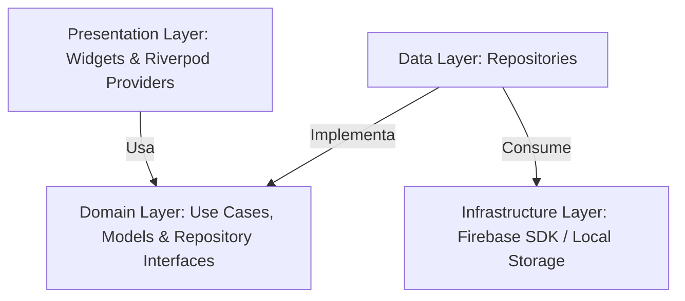
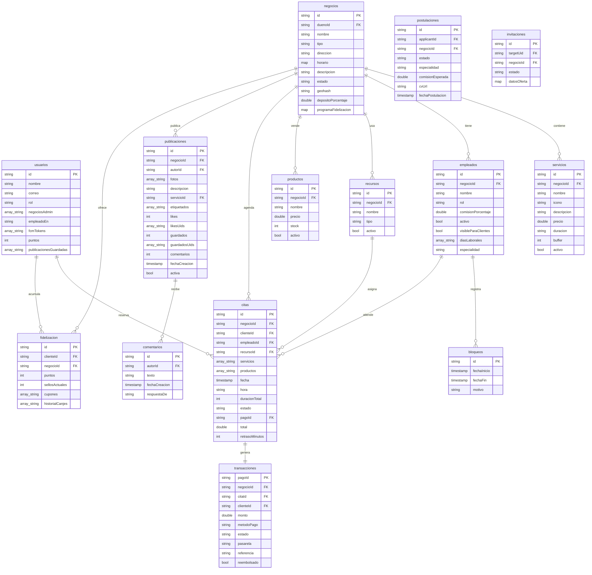

# FlowServ — Documentación de Estructura Interna y Diseño Técnico

Este documento detalla la arquitectura, el diseño de la base de datos, el stack tecnológico, las pantallas principales y los flujos de integración de **FlowServ**, una plataforma SaaS móvil multitenant diseñada para la gestión de citas, servicios, empleados y recursos en negocios de servicios (barberías, estéticas, lavaderos de autos, consultorios, spas, etc.).

---

## 1. Stack Tecnológico y Herramientas

FlowServ emplea un conjunto de tecnologías modernas que garantizan un desarrollo ágil multiplataforma, escalabilidad automática y alta disponibilidad:

### Frontend / Cliente Móvil y Web
*   **Flutter (Dart SDK >= 3.0.0 < 4.0.0)**: Framework principal para compilar aplicaciones nativas en Android, iOS y la plataforma Web desde una única base de código.
*   **Flutter Riverpod (^2.5.1)**: Sistema de gestión de estado reactivo y contenedor de inyección de dependencias para asegurar la desacoplabilidad del código.
*   **GoRouter (^14.7.2)**: Sistema de enrutamiento declarativo para Flutter que gestiona la navegación de la app con soporte para parámetros de ruta dinámicos y redirecciones basadas en el estado de autenticación y los roles del usuario.

### Backend y Servicios Serverless (Firebase)
*   **Firebase Auth**: Autenticación de usuarios segura que soporta login tradicional (correo y contraseña) y Google Sign-In (`google_sign_in`). Utiliza **Custom Claims** integrados en el token JWT para la determinación de roles.
*   **Cloud Firestore**: Base de datos NoSQL documental y en tiempo real que maneja la estructura multitenant y la sincronización sin conexión de forma nativa.
*   **Firebase Storage**: Almacenamiento en la nube para recursos multimedia (fotos de perfil, galerías de trabajos de negocios, y CV en formato PDF).
*   **Firebase Cloud Functions**: Lógica de backend serverless ejecutada en Node.js/TypeScript para tareas administrativas y de seguridad (actualización de roles, cálculo de ganancias, cierres de caja y envío de correos transaccionales).
*   **Firebase Cloud Messaging (FCM)**: Gestión y envío automatizado de notificaciones push a dispositivos móviles.
*   **Firebase Hosting**: Hospedaje de alto rendimiento para el panel de administración web.

### Librerías Clave del Ecosistema
*   `table_calendar`: Calendario interactivo optimizado para la selección y bloqueo de citas.
*   `flutter_local_notifications` y `timezone`/`flutter_timezone`: Programación y control de alarmas locales para recordatorios de citas en la zona horaria del cliente.
*   `image_picker` y `cached_network_image`: Selección y almacenamiento local de imágenes de galería y su renderizado con caché eficiente.
*   `flutter_svg` y `font_awesome_flutter`: Iconografía de alta calidad.
*   `local_auth`: Soporte para inicio de sesión seguro con biometría (huella/rostro).

### Integración de Terceros (APIs)
*   **MercadoPago / PayU**: Pasarelas de pago para el depósito/porcentaje de reserva y liquidación de servicios.
*   **SendGrid**: Envío automatizado de correos electrónicos transaccionales para reservas, postulaciones de empleo e invitaciones.
*   **Mapbox / Google Maps API**: Geolocalización y mapas para la visualización del explorador de negocios cercanos.

---

## 2. Arquitectura de Software

FlowServ se construye bajo la filosofía de **Clean Architecture** estructurada con un enfoque **Feature-First** (Funcionalidad Primero). Esta combinación permite aislar las reglas de negocio de los detalles de infraestructura (como Firebase o librerías de UI) y organizar las carpetas por módulos lógicos independientes.

### Diagrama de Comunicación de Capas



### Estructura de Directorios

La estructura interna del directorio `lib/` está organizada de la siguiente manera:

```
lib/
├── core/                         # Núcleo del sistema (compartido)
│   ├── theme/                    # Tokens de diseño: AppColors, AppTypography, AppSpacing
│   ├── widgets/                  # Componentes de interfaz de usuario reutilizables (Botones, textfields, etc.)
│   ├── navigation/               # Configuración de GoRouter con guardias de ruta y lógica de redirección
│   └── services/                 # Servicios globales (ej. NotificationService)
│
└── features/                     # Módulos del negocio organizados por funcionalidad
    ├── auth/                     # Autenticación y registro de usuarios
    ├── home/                     # Pantalla de inicio, explorador, perfiles y flujo de agendamiento
    └── admin/                    # Panel administrativo, finanzas, empleados y configuración
```

Cada módulo dentro de `features/` está dividido en las siguientes capas de Clean Architecture:

1.  **Domain (Dominio)**: Contiene las entidades puras del dominio de negocio (`models/`) y las interfaces de contratos (`repositories/`). Es código de Dart puro, **completamente libre de importaciones de Flutter o dependencias externas** (Firebase, etc.).
2.  **Data (Datos)**: Implementa los contratos definidos en la capa de dominio. Aquí se realiza la comunicación directa con Firebase Firestore, Firebase Storage y las APIs externas (`repositories/`).
3.  **Presentation (Presentación)**: Define la interfaz de usuario (pantallas y componentes específicos) y gestiona el estado reactivo mediante proveedores de Riverpod (`providers/` y `screens/`).

---

## 3. Modelo y Diagrama de Base de Datos (Cloud Firestore)

FlowServ utiliza **Cloud Firestore** como base de datos NoSQL documental. La estructura se modela mediante colecciones raíz y subcolecciones para soportar el aislamiento multitenant.

### Diagrama de Entidad-Relación (Mermaid ER)



### Detalle de Colecciones Firestore

1.  **`usuarios`**: Guarda los perfiles de los usuarios y metadatos clave para cambiar de contexto (Admin, Empleado, Cliente).
2.  **`negocios`**: Documento raíz de cada tenant. Alberga los siguientes subdocumentos y subcolecciones:
    *   **`servicios`**: Catálogo de prestaciones disponibles.
    *   **`empleados`**: Datos operativos, comisiones y especialidades de los profesionales.
        *   **`bloqueos`**: Intervalos de tiempo bloqueados por el empleado (por ejemplo, vacaciones o almuerzos).
    *   **`recursos`**: Equipos físicos o espacios de trabajo (sillas, bahías de lavado, cabinas) necesarios para evitar conflictos en el agendamiento.
    *   **`productos`**: Stock y precio de artículos comerciales de venta en el negocio.
    *   **`galeria`**: Fotografías cargadas por el negocio asociadas a servicios.
3.  **`citas`**: Colección raíz que conecta negocio, cliente, empleado, recursos, servicios agendados y estado operativo.
4.  **`transacciones`**: Registro de pasarela de pagos con referencias y estados de reembolso.
5.  **`publicaciones`**: Feed social que enlaza publicaciones con imágenes de trabajos, likes, guardados y la subcolección de `comentarios`.
6.  **`postulaciones`** e **`invitaciones`**: Gestión del flujo de contratación de profesionales en la plataforma.
7.  **`ganancias`** y **`cierresCaja`**: Documentos financieros agregados diariamente para reportes y auditoría del administrador.
8.  **`fidelizacion`**: Historial de puntos, sellos acumulados y cupones de descuento activos para clientes en un negocio en particular.

---

## 4. Módulos y Pantallas Principales

La aplicación se estructura en tres flujos principales adaptables al tipo de usuario activo en el menú lateral o de perfil:

### Módulo de Autenticación (`features/auth`)
*   **Inicio de Sesión (`login_screen.dart`)**: Login unificado por correo/contraseña o Google. No requiere que el usuario elija su rol de entrada; el sistema detecta sus permisos leyendo los Custom Claims del token JWT de Firebase.
*   **Registro Multietapa (`register_step_one_screen.dart`, `_two_`, `_three_`)**: Registro asistido que captura datos personales de forma progresiva.
*   **Recuperación de Contraseña (`forgot_password_screen.dart`)**: Envío de correo de reestablecimiento de contraseña.

### Módulo de Cliente / Exploración (`features/home`)
*   **Pantalla de Inicio (`home_screen.dart`)**: Muestra banners de promociones, selector de categorías de negocio (barberías, estéticas, etc.) y una lista interactiva de negocios cercanos con su valoración y distancia.
*   **Perfil de Negocio (`business_profile_screen.dart`)**: Vista detallada de un establecimiento, descripción, galería de fotos, opiniones de clientes, servicios del catálogo y lista de profesionales.
*   **Flujo de Agendamiento (`booking_flow_screen.dart`)**: Asistente dinámico para la selección de múltiples servicios, profesional disponible, fecha (usando `table_calendar`) y hora libre del empleado y recurso físico (motor anti-conflictos de agenda).
*   **Mis Reservas (`orders_screen.dart`)**: Consulta del estado de citas actuales e históricas, con opciones de cancelación o reprogramación.
*   **Configuración y Perfil (`personal_data_screen.dart`, `security_screen.dart`, `settings_screen.dart`)**: Gestión de datos de cuenta, seguridad biométrica e idioma.
*   **Registro de Negocio (`register_business_step_one.dart` al `_three_`)**: Asistente interactivo de 4 pasos para que cualquier usuario registre su propio negocio y se convierta en administrador.

### Módulo Administrativo y de Empleados (`features/admin` & `features/home/presentation/screens/professional_schedule_screen.dart`)
*   **Dashboard de Control (`admin_dashboard_screen.dart`)**: Panel que muestra KPIs financieros en tiempo real (ingresos, citas, tasa de ocupación), citas del día, solicitudes pendientes y postulaciones de empleados.
*   **Administración de Personal (`team_management_screen.dart` y `professional_schedule_screen.dart`)**: Configuración de comisiones de empleados, visualización de agendas, aprobación de postulaciones o envío de invitaciones directas de trabajo por correo.
*   **Control de Servicios y Productos (`manage_services_screen.dart`, `manage_products_screen.dart`)**: Configuración de precios, stock de productos, duración de servicios y tiempos de buffer.
*   **Finanzas e Informes (`admin_finances_screen.dart`)**: Registro de ingresos y egresos, comisiones acumuladas de la plataforma y módulo para el Cierre de Caja diario.
*   **Galería y Red Social (`manage_gallery_screen.dart`, `new_post_flow.dart`)**: Creación de nuevas publicaciones para el feed de la aplicación (etiquetando empleados o servicios específicos).

---

## 5. Lógica del Sistema de Roles y Multitenencia

FlowServ permite que una sola cuenta de usuario asuma múltiples roles simultáneamente (Cliente, Empleado y Administrador de uno o varios negocios) sin necesidad de cerrar sesión.

```
                  ┌──────────────────────┐
                  │      REGISTRO        │
                  │ (Cliente automático) │
                  └──────────┬───────────┘
                             │
            ┌────────────────┼────────────────┐
            ▼                ▼                ▼
     ┌──────────────┐ ┌──────────────┐ ┌──────────────┐
     │   CLIENTE    │ │  EMPLEADO    │ │  ADMINISTR.  │
     │ Reserva      │ │ Postulación  │ │ Crea negocio │
     │ citas        │ │ aprobada     │ │ y gestiona   │
     │ en locales   │ │ (empleadoEn) │ │ (adminBiz[]) │
     └──────────────┘ └──────────────┘ └──────────────┘
```

1.  **Detección de Contexto**: Al autenticar al usuario, la aplicación lee los *Custom Claims* en el JWT de Firebase Auth:
    *   `rol`: Tipo de rol principal (usualmente `"usuario"`).
    *   `negociosAdmin`: Lista de IDs de negocios propiedad del usuario.
    *   `empleadoEn`: ID del negocio donde el usuario labora como profesional.
2.  **Transición de Pantallas**: Si el token contiene negocios en `negociosAdmin` o un valor en `empleadoEn`, se habilitan los accesos en el menú de perfil ("Mi Negocio" / "Modo Empleado"). El contexto activo se almacena localmente en `SharedPreferences` para preservar la vista del usuario en su próxima sesión.
3.  **Seguridad a Nivel de Datos**: Las *Firestore Security Rules* garantizan el aislamiento multitenant. Ningún empleado o cliente puede consultar datos privados de transacciones, configuraciones de recursos u otros usuarios a menos que su token JWT coincida con el `negocioId` correspondiente o sea dueño del recurso.

---

## 6. Anexos y Guías de Configuración

### Anexo A: Guía de Inicio Rápido para Desarrolladores

Para que un desarrollador externo pueda levantar el proyecto localmente y empezar a programar en menos de 5 minutos, debe seguir estos pasos:

#### 1. Requisitos Previos
*   **Flutter SDK**: Versión `>= 3.0.0` instalada y configurada en las variables de entorno.
*   **Node.js**: Versión `>= 18.0.0` (necesaria para ejecutar y probar las Firebase Cloud Functions locales).
*   **Firebase CLI**: Instalado de forma global en el sistema (`npm install -g firebase-tools`).

#### 2. Preparación del Entorno
Ejecuta los siguientes comandos en la terminal desde la raíz del proyecto para descargar las dependencias del frontend:
```bash
flutter pub get
```

Si vas a realizar cambios en las Cloud Functions del backend, navega a la carpeta correspondiente e instala sus dependencias de Node.js:
```bash
cd functions
npm install
```

#### 3. Ejecución Local (Emuladores de Firebase)
Para probar la base de datos Firestore, la autenticación y las funciones sin afectar el entorno de producción, levanta la suite de emuladores locales de Firebase:
```bash
firebase emulators:start
```
Una vez encendido, inicia la aplicación de Flutter apuntando al entorno local de emulación (modificando la inicialización en `main.dart`).

---

### Anexo B: Resumen de Reglas de Seguridad en Cloud Firestore

Para garantizar el aislamiento de datos entre los distintos negocios (multitenancy), se implementan las siguientes políticas de seguridad en las **Firestore Security Rules**:

1.  **Colección `usuarios`**:
    *   *Lectura/Escritura*: Permitida únicamente si el ID del documento coincide con el UID del usuario autenticado (`request.auth.uid == userId`).
2.  **Colección `negocios` y subcolecciones (`servicios`, `empleados`, `productos`)**:
    *   *Lectura*: Permitida para usuarios autenticados.
    *   *Escritura*: Restringida. Solo el propietario o un administrador del negocio cuyo UID esté en la lista `negociosAdmin` del token JWT puede crear, modificar o eliminar registros.
3.  **Colección `citas`**:
    *   *Clientes*: Pueden crear citas y leer solo las citas donde su `clienteId` coincida con su UID.
    *   *Empleados*: Tienen acceso de lectura a las citas donde su `empleadoId` coincida con su claim `empleadoEn`.
    *   *Administradores*: Tienen permisos totales de lectura y edición de todas las citas asociadas al ID de su negocio (`negocioId`).
